# 使用Nuttx

## 0. 前言 

这里不说Nuttx特别底层的东西，只说如何使用Nuttx开发应用程序，因为大部分情况，领导关心的是应用如何写的快而不是底层是如何工作的。

本文档默认你会使用Kconfig、Linux。

之所以选择Nuttx作为操作系统，一是因为Nuttx提供的接口支持Posix，大部分Linux上的应用程序都可以移植过来，对于比较复杂的应用，这点是极好的；二是Nuttx支持动态加载程序，也就是说Nuttx可以在线进行应用的升级。

这篇文章从以下几点切入，说一下如何使用Nuttx进行应用开发：

1. Nuttx的目录结构
2. 如何编译及下载到开发板上
3. 如何驱动一个设备(这里写一个闪灯的例子，使用GPIO方式驱动)
4. 如何在app中添加一个应用
5. 如何设置app自启动

题主这里使用的开发板是从淘宝买的一个cortex-m4的开发板，芯片是STM32F407VET6。

ps. 下面要说的东西，大部分都是从Nuttx官方的文档中得到的，小部分自己加工的，如有说错的地方，请斧正：[ijulyrain@gmail.com](ijulyrain@gmail.com)

## 1. Nuttx的目录结构

在说Nuttx目录之前，先说下如何安装Nuttx。

Nuttx的官方网站是：[http://www.nuttx.org](http://www.nuttx.org)

Nuttx的源代码托管在[bitbucket](https://bitbucket.org)上，一个类似[github](https://github.com)的代码托管网站。

nuttx从工程上，将内核和app的代码分离的开，他们的下载地址分别是：

    内核:
    git clone https://bitbucket.org/nuttx/nuttx.git nuttx

    app:
    git clone https://bitbucket.org/nuttx/apps.git apps

    tools:
    git clone https://bitbucket.org/nuttx/tools.git tools

推荐的目录结构是：

                      |
            +---------+---------+
            |         |         |
          nuttx/    tools     apps/

ok，nuttx最主要的两部分nuttx和apps就拿到手了。

tools里面是一些工具，例如kconfig-frontends、genromfs等，缺什么装什么即可.

题主写这边文档的时候，Nuttx最新的版本是7.25，apps最新版本是7.26.

进入到nuttx中，看一下内核的目录：

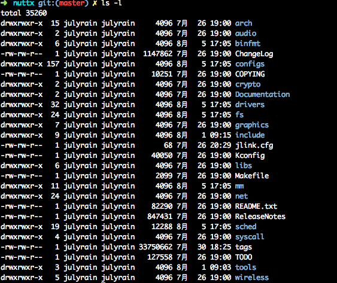

乍一看，目录结构是不是特别熟悉。

|目录|主要功能|
|---|-------|
|arch|存放不同体系结构的代码，nuttx目前包含了arm、mips、avr等|
|audio|音频子系统|
|binfmt|二进制格式，nuttx支持elf和nxflat|
|configs|已经配置好的bsp，里面包含了arch所有的体系结构的demo|
|crypto|一些加密算法|
|Documentation|文档，很丰富|
|drivers|驱动代码，常见设备驱动这里基本都有|
|fs|文件系统相关，支持常见的vfat、nfs、romfs等，还有nuttx为flash设计的nxffs|
|graphics|图形子系统|
|include|头文件|
|libs|nuttx的库文件|
|mm|nuttx的内存管理|
|net|nuttx实现的网络协议栈，支持ipv4和ipv6|
|sched|调度器、线程、信号量、定时器等|
|syscall|系统调用|
|tools|构建用到的工具|
|wireless|无线相关，蓝牙，ieee802154等|

接下来的开发中，我们最常进入的几个目录依次是：`configs`、`arch`、`drivers`

下面进入到apps中，看下apps的目录结构：

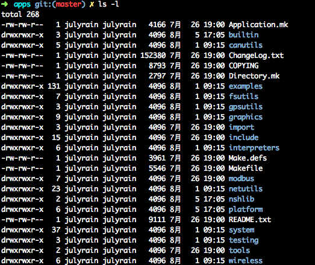

可以看到apps里面集成了许多应用库，例如modbus，json等，具体目录的功能这里就不细说了。

`examples`里面是一些应用的例子，你想要的这里基本都能找到。

`nshlib`是nuttx自带的一个shell，操作类似linux的bash。

## 2. 如何配置、编译及下载到开发板上

好了，nuttx的目录结构说完了，下面说下如何去使用Nuttx。

从头去创建一个bsp，这个比较麻烦，一般的做法都是从configs中找一个别人做好的bsp。

这里我用到的bsp是`stm32f4discovery`，这个bsp使用的单片机是STM32F407VGT6，与我的开发板单片机封装一样，只是FLASH差了512KB。

在使用开发板之前，肯定要看下原理图，至少要知道晶振频率、串口输出。

首先是晶振频率，开发板上是25MHz。

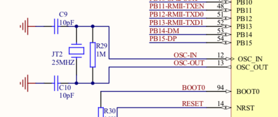

再看下哪个串口接出来了，开发板上是USART1，使用了PA9,PA10这两个GPIO。

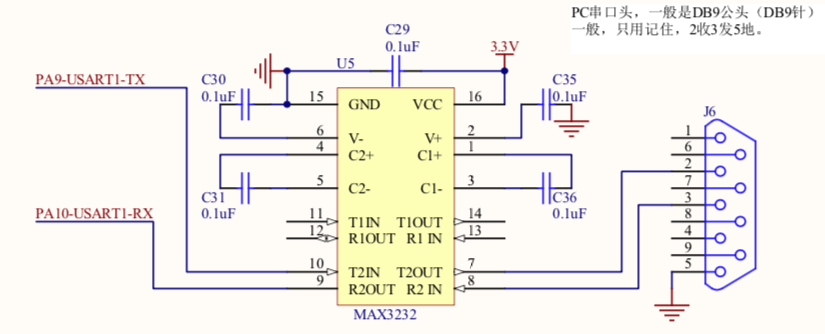

ok，先配置时钟，这是单片机能正常运行的基础。stm32f407VET6主频最大可以工作在168MHZ，也就是说我们要倍频到168MHZ

时钟配置在`configs/stm32f4discovery/include/board.h`下：

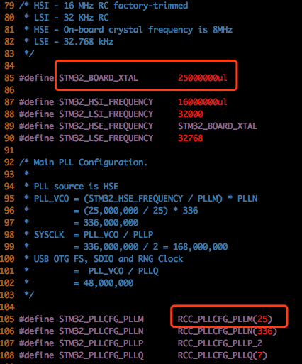

`stm32f4discovery`原来的晶振是8MHZ，倍频到168MHz。需要修改的地方，在上图已经标记出来了。

时钟配置完成后，下面就开始配置nuttx工程。我们的目标是配置一个最小系统：`使用串口1输出nsh、有/proc文件系统`

### 第一步. 选择`stm32f4discovery`这个bsp下的`nsh`配置，这个算是比较干净的配置了。

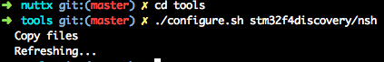

这一步的作用，主要是将`configs/stm32f4discovery/nsh/defconfig`拷贝成`.config`，供下一步`make menuconfig`使用

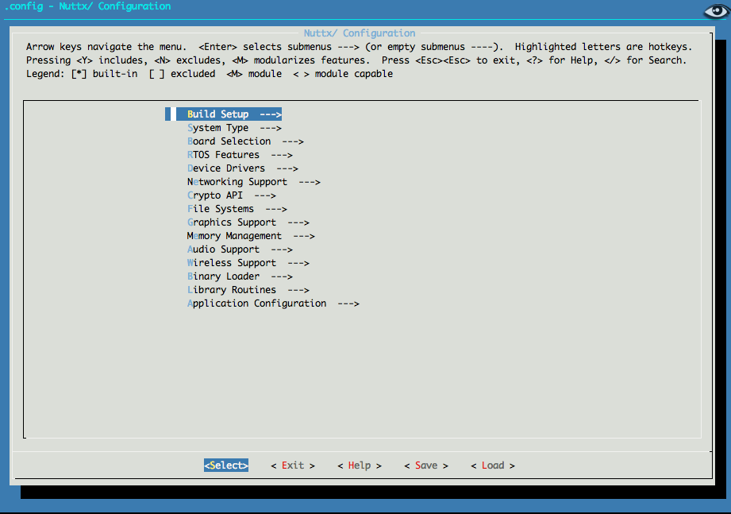

解释下每个配置项的作用：

|配置项|作用|
|-----|----|
|Build Setup|编译配置，如Debug信息、构建所在的平台、输出的二进制格式、优化选项等|
|System Type|系统配置，如使用的芯片外设、启动方式等|
|Board Selection|与开发板相关的配置|
|RTOS Features|操作系统特性，如线程、调度器、消息等|
|Device Drivers|设备驱动|
|Networking Support|网络支持|
|Crypto API|加密算法配置|
|File Systems|文件系统配置|
|Graphics Suppors|图形界面配置|
|Memory Managements|内存管理配置|
|Audio Support|音频相关配置|
|Wireless Support|无线相关配置|
|Binary Loader|动态加载二进制配置|
|Library Routines|库相关配置|
|Application Configuration|应用程序相关配置

下面将我配置好的配置项提取出来，如下：

    Build Setup  --->
        Build Host Platform (Linux)  --->
            (X) Linux
            构建平台为Linux
        Binary Output Formats  --->
            [*] Intel HEX binary format
            输出hex
            [*] Raw binary format
            输出bin
    
    System Type  --->
        STM32 Peripheral Support  --->
            [*] USART1
            使能外设USART1
        U[S]ART Configuration  --->
            Serial Driver Configuration  --->
                [*] Disable reordering of ttySx devices.
                这个选项的作用是，禁止重新排序ttySx设备文件
                如果不禁用这个，ttyS1永远指向作为终端的串口
                也就是说，如果USART3是终端，ttyS1就指向USART3，而不是USART1
    
    RTOS Features  --->
        RTOS hooks  --->
            [*] Custom board/driver initialization
            这个选项的作用是，调用客户定制的初始化，不然是注册不了驱动的
    
    Device Drivers  --->
        [*] Serial Driver Support  --->
            Serial console (USART1)  ---> 
                (X) USART1
                串口1作为终端
            USART1 Configuration  --->
               (115200) BAUD rate   波特率
               (8) Character size   数据位
               (0) Parity setting   校验位
               (0) Uses 2 stop bits 停止位
    
    File Systems  --->
        [*] PROCFS File System
        支持/proc

    Application Configuration  --->
        Examples  --->
            [*] "Hello, World!" example
            (100) Hello task priority
            (2048) Hello stack size
            添加一个helloworld应用

ok，到这里，我们要的最小系统就配置好了：

1. 驱动了串口1，115200 8,n,1
2. nsh终端从串口1输出
3. 支持proc文件系统 

在执行make编译之前，还有一点别忘了，就是USART1的引脚我们还没有配置。引脚配置也在`configs/stm32f4discovery/include/board.h`下:

原来`stm32f4discovery`这个bsp使用的是USART2作为终端

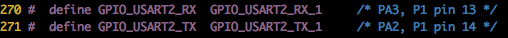

`GPIO_USART2_RX_1`, `GPIO_USART2_TX_1` 这两个宏定义是具体的引脚，`GPIO_USART2_RX`, `GPIO_USART2_TX` 再映射到对应引脚上。

`GPIO_USART2_RX_1`, `GPIO_USART2_TX_1` 具体的定义在 `arch/arm/src/stm32/chip/stm32f40xxx_pinmap.h`下

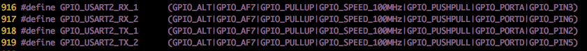

类比着，我们找到PA9, PA10的引脚，对应的是多少：

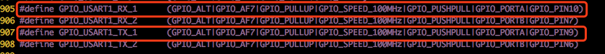

我们在`configs/stm32f4discovery/include/board.h` 加上宏定义映射`GPIO_USART1_RX`, `GPIO_USART1_TX`

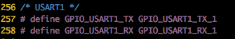

### 第二步. 使用arm-none-eabi-gcc编译

题主使用的Linux系统是Mint 18.3，基于Ubuntu优化的一个Linux发行版，可以直接通过`apt-get`安装`arm-none-eabi-gcc`

    sudo apt-get install gcc-arm-none-eabi

安装好之后，直接执行`make`，编译nuttx.bin和nuttx.hex

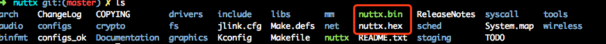

### 第三步. 使用Jlink下载到开发板上

 题主使用的JLink V8, [SEGGER](https://www.segger.com/downloads/jlink/#J-LinkSoftwareAndDocumentationPack)官网上有驱动下载：

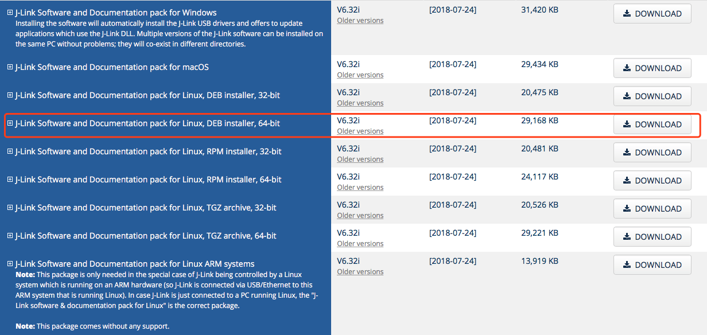

JLink驱动下载安装完毕后，可以通过`JlinkExe`这个命令下载nuttx.bin

贴出题主使用的配置文件jlink.cfg:

    device stm32f407ve
    r
    h
    erase
    loadbin ./nuttx.bin,0x08000000
    g
    exit

指令的意思是：

    Device     Selects a specific device J-Link shall connect to
               and performs a reconnect.
    r          Reset target         (RESET)
    h          halt
    erase      Erase internal flash of selected device. Syntax: Erase
    loadbin    Load *.bin file into target memory.
               Syntax: loadbin <filename>, <addr>
    g          go

下载nuttx.bin:

下载完毕后，接上串口线，打开minicom，就可以看到`nsh`的提示符了

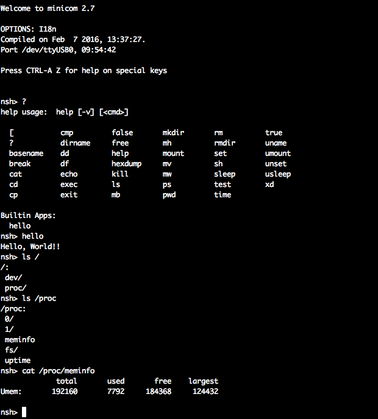

## 3. 如何驱动一个设备

nuttx的驱动体系结构类似linux，所以有linux内核基础的你，上手很快。

GPIO驱动是最简单的一个驱动了，正好我的开发板上有几个灯，可以驱动起来做个闪灯

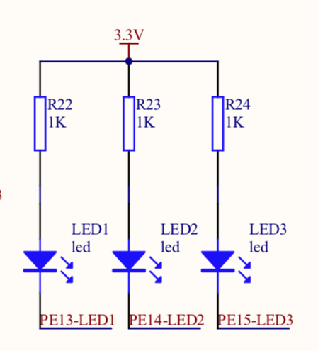

这是三个共阳极的灯，使用`PE13`,`PE14`,`PE15`这三个GPIO控制量灭，输出0时灯亮，输出1时灯灭。

ok，下面开始我们开始添加驱动。GPIO的顶层驱动在`drivers/ioexpander/gpio.c`

打开看一下驱动的注册函数：

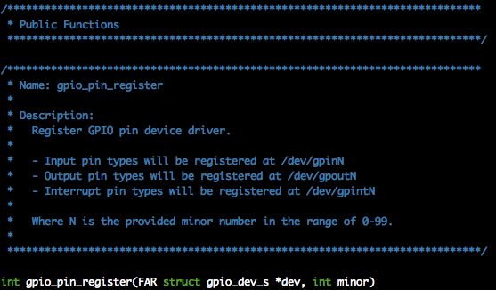

这里使用了一个`struct gpio_dev_s`，我们看一下它的定义:

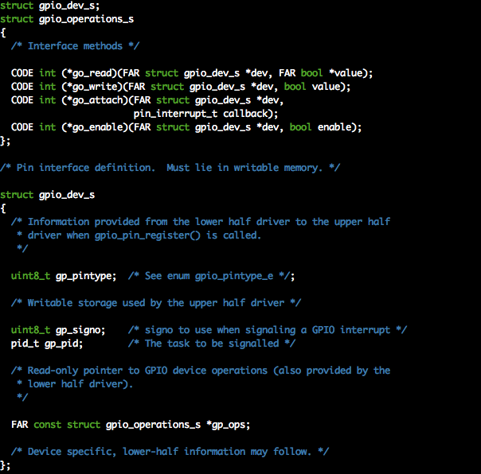

也就是说，我们需要在bsp中实现`struct gpio_operations_s`定义的接口

我们看一下`drivers/ioexpander/gpio.c`里面是如何调用`struct gpio_operations_s`的:

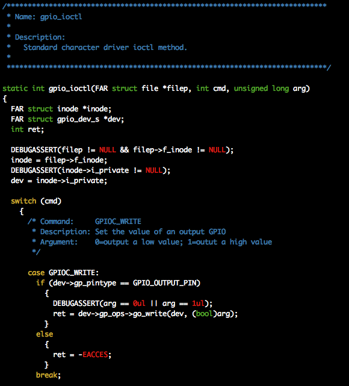

使用的是`ioctl`接口，cmd是`GPIOC_WRITE`，调用的是`go_write`接口。

看到这里，我们大概就知道如何去做这个GPIO驱动了，只需要在bsp中GPIO底层驱动实现`struct gpio_operations_s`里面的`go_write`即可.

我们到`configs/stm32f4discovery/src`下，看一下：

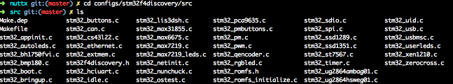

发现没有`stm32_gpio.c`这个文件，我们可以从别的bsp中拷贝一个，这里使用`stm32f103-minimum`中的`stm32_gpio.c`，其实内部操作都一样。

这里我们只需要`OUTPUT`这一种GPIO，把其他的删掉。

下面配置PE13,PE14,PE15这三个引脚:

`configs/stm32f4discovery/include/board.h`下

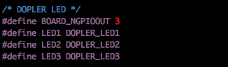

`configs/stm32f4discovery/src/stm32f4discovery.h`下

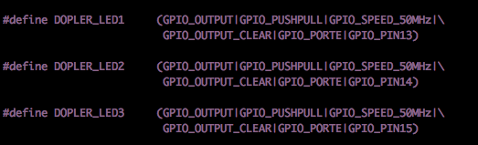

`configs/stm32f4discovery/src/stm32_gpio.c`下

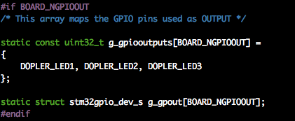

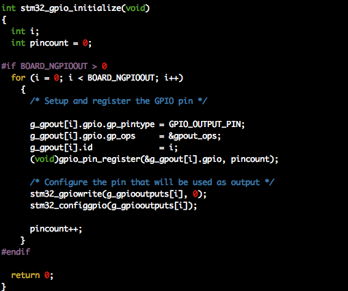

当使用ioctl操作GPIO的时候，就会调用到`gpout_read`, `gpout_write`函数，其实就是对GPIO寄存器的读写

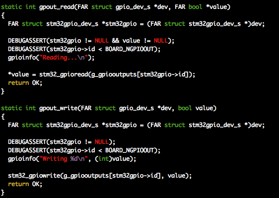

好了，GPIO的底层驱动我们写完了，下一步就是要将GPIO的驱动加入到初始化列表里面:

bsp初始化函数是在`configs/stm32f4discovery/src/stm32_bringup.c`里的`stm32_bringup`

将bsp中gpio的注册函数加进去

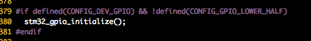

Kconfig把GPIO的驱动选上

    Device Drivers  --->
        IO Expander/GPIO Support  --->
            [*] GPIO driver

编译，下载nuttx.bin，就可以在`/dev/`下看到注册的GPIO设备文件了:

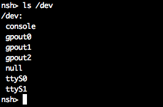

## 4. 如何在app中添加一个应用

上一节我们把3个LED的驱动都写好了，也注册进了操作系统中了，下面我们写个app来控制一下这几个灯

一般的做法是, 把app创建在`apps/examples`下，这里我们添加一个应用程序`myled`

首先，在`apps/examples/`下，拷贝`hello`成`myled`，我们主要用里面的文件

进入到myled下，重命名一下hello_main.c到myled_main.c

|文件|作用|
|---|----|
|Kconfig|Kconfig配置文件|
|Make.defs|添加应用目录到构建列表|
|Makefile|make编译规则文件|
|myled_main.c|应用程序入口源文件|

了解这些文件的用途，下面开始改动他们：

`KConfig`

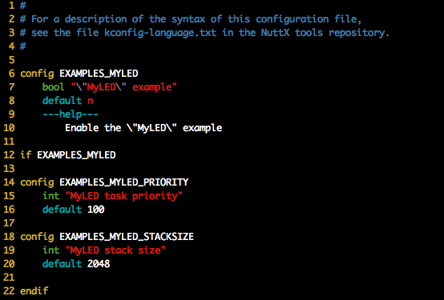

`Make.defs`

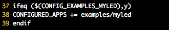

`Makefile`

> 注意下 APPNAME = myled，结尾不要有空格，这个变量是拼接字符串用的，有空格会找不到入口函数

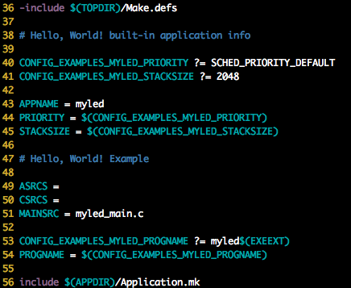

`myled_main.c`

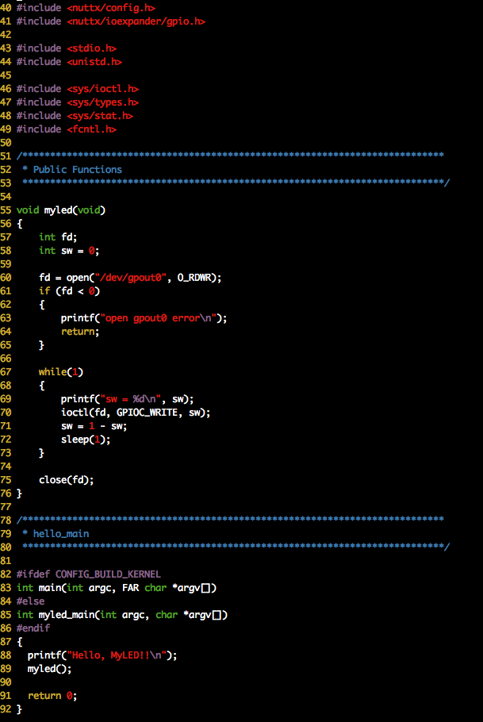

到此，`myled`应用就写完了，LED1会以1秒的频率亮灭。

下面将`myled`这个应用编译进来

    Application Configuration  --->
        Examples  --->
            [*] "MyLED" example
            (100) MyLED task priority
            (2048) MyLED stack size

编译，下载nuttx.bin，就可以看到myled这个应用了，运行后可以看到LED1在闪烁:

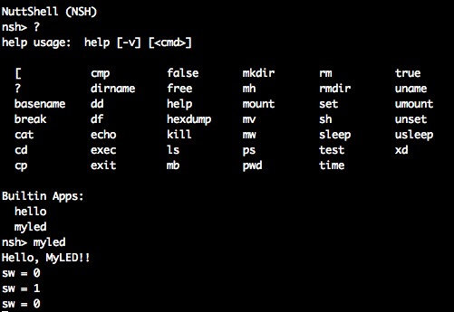

## 5. 如何设置app自启动 

以上我们写的myled，是不能自启动的，系统复位以后，就又回到nsh了。

下面说下如何让nuttx一启动就运行`myled`

nuttx是支持启动脚本的，这点与linux相似，可以通过`/etc/init.d/rcS`脚本启动应用程序。下面就是如何将rcS文件做到系统中了。

怎么做，nuttx其实已经说了，说明在`apps/nshlib/README.txt`，写的比较散，下面我来演示下如何具体操作:

首先在`configs/stm32f4discovery/include`下创建`etc`，结构如下：

    etc
    └── init.d
        └── rcS

`rcS`文件把要启动的应用写上：

    dopler &

    nsh是支持应用后台运行的

下一步，制作romfs：

    genromfs -f romfs_img -d etc
    xxd -i romfs_img >nsh_romfsimg.h

`nsh_romfsimg.h`就是romfs的十六进制表示，注意这个名字是固定的

下面，让nuttx支持romfs，并将`nsh_romfsimg.h`编译进去

    File Systems  --->
        [*] ROMFS file system
    
    Application Configuration  --->
        NSH Library  --->
            Scripting Support  --->
                [*] Support ROMFS start-up script
                (/etc) ROMFS mount point (NEW)
                (init.d/rcS) Relative path to startup script (NEW)
                ROMFS header location (Architecture-specific ROMFS path)  --->

                这个选项的意思是，使用体系结构指定的nsh_romfsimg.h
                nshlib会去使用<arch/board/nsh_romfsimg.h>这个文件
                你到nuttx的include下找下这个文件，你就知道是怎么回事了

编译，下载nuttx.bin，然后启动nuttx，就看到myled已经在运行了!

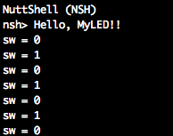

谢谢！